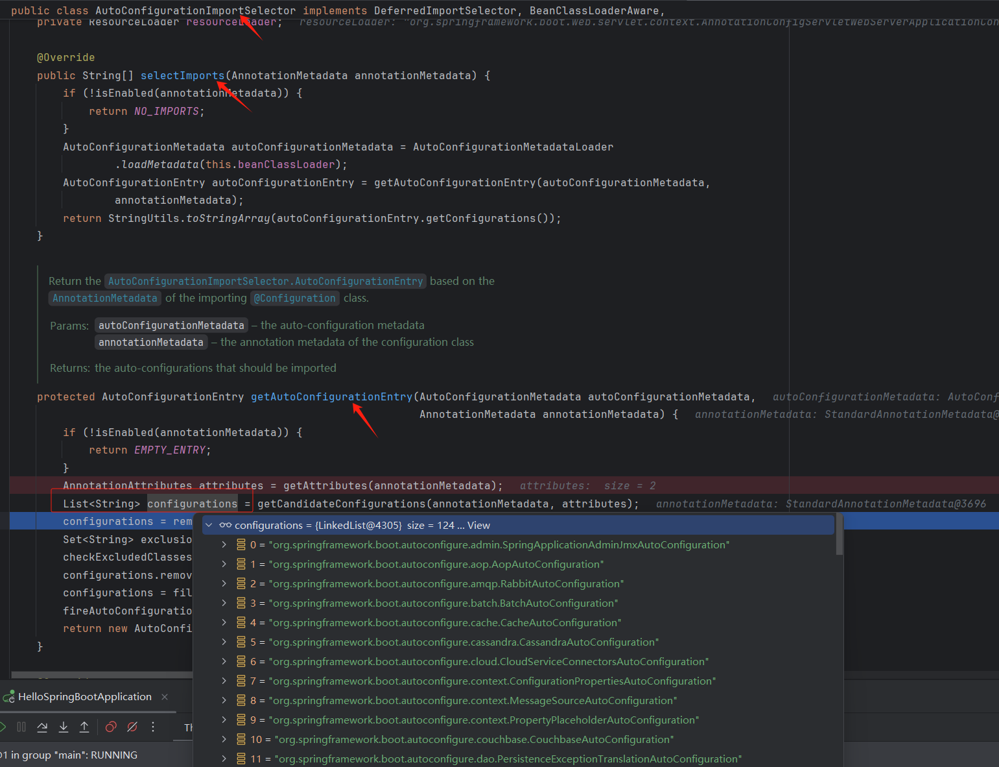

# Spring Boot-- start

## 1 Spring Boot 简介
SpringBoot 用来简化Spring应用开发的框架，约定大于配置，去繁从简，just run 就能创建一个独立的应用。

User --> Spring Boot --> Spring

技术演进：
- Spring、Spring 全家桶
- Spring Boot --> J2EE 一站式解决方案
- Spring Cloud --> 分布式整体解决方案

## 2 微服务架构简介
微服务是一种架构风格，它将一个大型的单体应用拆分成多个小型的、相互独立的服务，每个服务都可以独立地进行开发、部署和扩展。

- 有什么特点
  - 单一职责
  - 轻量级通信
  - 独立部署
  - 技术多样性
  - 去中心化治理

- 为什么选择微服务架构
  - 敏捷开发与部署  
  - 可扩展性
  - 技术灵活性
  - 高可用性

- 使用微服务技术可能会带来哪些问题或挑战
  - 运维复杂性
  - 分布式事务处理  
  - 服务间通信开销  
  - 服务治理难度大  

- 微服务技术的应用场景
  - 大型复杂系统
  - 多团队协作项目
  - 业务快速变化的领域
  - 异构系统集成

## 3 Hello SpringBoot

创建 Hello SpringBoot 工程的主要步骤：
- 创建Maven工程
- 导入Spring Boot 相关依赖
  ```pom
  <parent>
        <groupId>org.springframework.boot</groupId>
        <artifactId>spring-boot-starter-parent</artifactId>
        <version>2.2.1.RELEASE</version>
    </parent>

    <dependencies>
        <!-- 实现对 Spring MVC 的自动化配置 -->
        <dependency>
            <groupId>org.springframework.boot</groupId>
            <artifactId>spring-boot-starter-web</artifactId>
        </dependency>
    </dependencies>
  ```
- 编写主程序类
  ```java
  /**
  *
  * SpringBootApplication注解：用于标注主程序类，说明这是一个 Spring Boot 应用
    */
    @SpringBootApplication
    public class HelloSpringBootApplication {

    public static void main(String[] args) {

         // 启动应用
         SpringApplication.run(HelloSpringBootApplication.class, args);
    }

  }
  ```
- 编写 control、service
- HelloSpringBootApplication 直接run主程序
- 简化部署，打包配置插件
  ```pom
    <build>
        <plugins>
            <!-- 将应用打包成可自行jar -->
            <plugin>
                <groupId>org.springframework.boot</groupId>
                <artifactId>spring-boot-maven-plugin</artifactId>
            </plugin>
        </plugins>
    </build>
  ```
  maven package 将SpringBoot应用打包，用 java -jar 命令执行。
  | 注：如果一个SpringBoot应用中有多个主程序类会报错。

## 4 Hello SpringBoot 探究

### 4.1 从 Hello SpringBoot 看场景启动器

- 父项目pom依赖
    ```pom
    // -->spring-boot-starter-parent
    <parent>
        <groupId>org.springframework.boot</groupId>
        <artifactId>spring-boot-starter-parent</artifactId>
        <version>2.2.1.RELEASE</version>
    </parent>
  
   // -->spring-boot-dependencies
   <parent>
    <groupId>org.springframework.boot</groupId>
    <artifactId>spring-boot-dependencies</artifactId>
    <version>2.2.1.RELEASE</version>
    <relativePath>../../spring-boot-dependencies</relativePath>
  </parent>****
    ```
  - spring-boot-dependencies 版本仲裁中心，用来约定、管理Spring Boot项目中所有依赖配置的版本；也就是说在依赖配置中的都不需要加版本号，不在的需要声明版本号
  | 注：Spring Boot后续版本中有所变化，主要是简化了一些配置依赖

- spring-boot-starter-web
  ```xml
  <dependencies>
        <!-- 实现对 Spring MVC 的自动化配置 -->
        <dependency>
            <groupId>org.springframework.boot</groupId>
            <artifactId>spring-boot-starter-web</artifactId>
        </dependency>
    </dependencies>
  ```
  spring-boot-starter-web 启动器，用于导入web模块依赖的组件，进入spring-boot-starter-web查看，其中包含了：

   - spring-boot-starter：spring-boot场景启动器等
   - web模块依赖的组件：spring-web、spring-webmvc等
 
  Spring Boot 将所有的场景抽取出来封装成一个个starter（场景启动器），只需要在pom中引入相关场景的starter，就能加载相应场景的依赖，比如：spring-boot-starter-aop。


### 4.2 从 Hello SpringBoot 看自动配置

```java
  /**
   *
   * SpringBootApplication注解：用于标注主程序类，说明这是一个 Spring Boot 应用
   */
  @SpringBootApplication
  public class HelloSpringBootApplication {
  
    public static void main(String[] args) {
  
      // 启动Spring应用
      SpringApplication.run(HelloSpringBootApplication.class, args);
    }
  
  }

```
-   @SpringBootApplication : Spring Boot应用标注，标注的类说明是SpringBoot的主配置类，通过启动这个主配置类的main方法来启动Spring Boot 应用；
    ```java
        // SpringBootApplication 注解内部配置（组合注解）
        @Target(ElementType.TYPE)
        @Retention(RetentionPolicy.RUNTIME)
        @Documented
        @Inherited
        @SpringBootConfiguration
        @EnableAutoConfiguration
        @ComponentScan(excludeFilters = { @Filter(type = FilterType.CUSTOM, classes = TypeExcludeFilter.class),
        @Filter(type = FilterType.CUSTOM, classes = AutoConfigurationExcludeFilter.class) })
        public @interface SpringBootApplication {}

    ```
- @SpringBootConfiguration ：Spring Boot 配置注解，Spring Boot 定义的注解，内部封装了 @Configuration 注解，标注在某个类上，表示其为Spring Boot 应用的配置类；
  - @Configuration ：Spring 定义的注解，标注在某个类上，表示其为 Spring 配置类，相当于配置文件（也是Spring容器中的一种组件）
  
- @EnableAutoConfiguration ：开启自动配置功能，Spring中需要自己手工配置的东西，Spring Boot 都已经封装好了，只需要加 @EnableAutoConfiguration 告诉SpringBoot 开启自动配置
  
  ```java
        @AutoConfigurationPackage
        @Import(AutoConfigurationImportSelector.class)
        public @interface EnableAutoConfiguration {
            // 将主配置类（@SpringBootApplication标注的类）所在的包及子包下所有的组件扫描到Spring容器中
            String ENABLED_OVERRIDE_PROPERTY = "spring.boot.enableautoconfiguration";
        }
  ```
    - @AutoConfigurationPackage ：自动配置包
    - @Import(AutoConfigurationImportSelector.class)：@Import 向容器中导入组件，导入组件由 AutoConfigurationImportSelector 决定
      - AutoConfigurationImportSelector ：自动配置导包选择器，将所有配置的组件以全类名的方式返回，会给容器中导入所配置场景需要的自动配置类（xxxAutoConfiguration），并自动的配置好这些组件
      

  **自动装配原理**：@EnableAutoConfiguration注解中，导入了AutoConfigurationImportSelector，其中的代码逻辑 SpringFactoriesLoader.loadFactoryNames(EnableAutoConfiguration.class, beanClassLoader) 
                 读取 META-INF/spring.factories 文件中@EnableAutoConfiguration 注解指定的值，将这些值作为自动配置类导入到Spring容器中，从而帮我们完成繁琐的手工配置步骤。

## 5 快速创建向导

- https://start.spring.io/index.html
- https://start.aliyun.com/

## 参考资料
- [SpringBoot 视频教程全集（112P）| 23 小时从入门到精通](https://www.bilibili.com/video/av59572480/)
