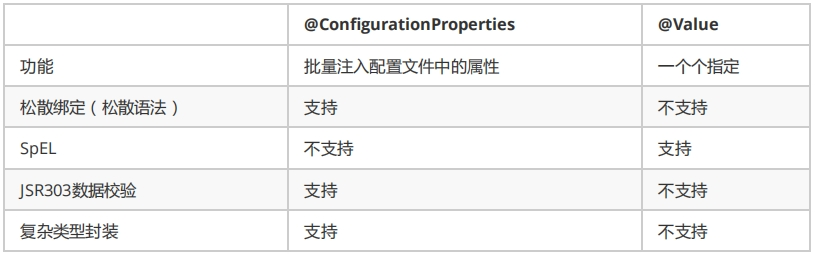
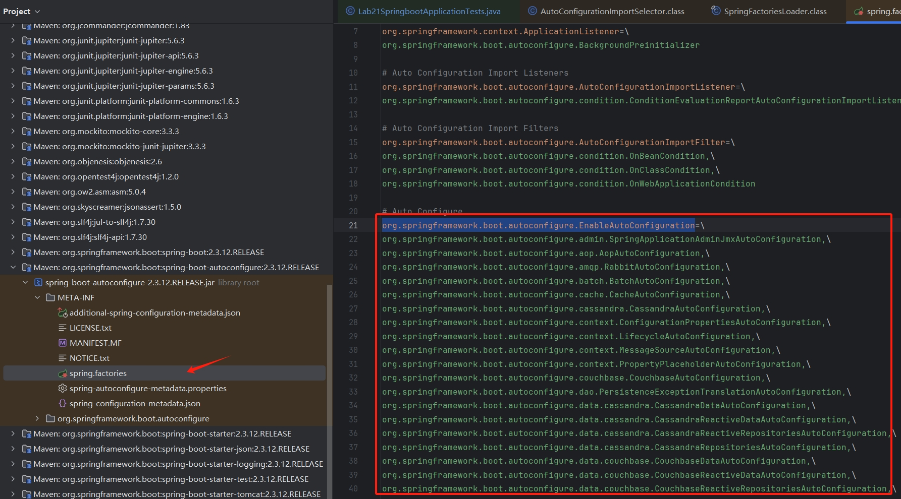
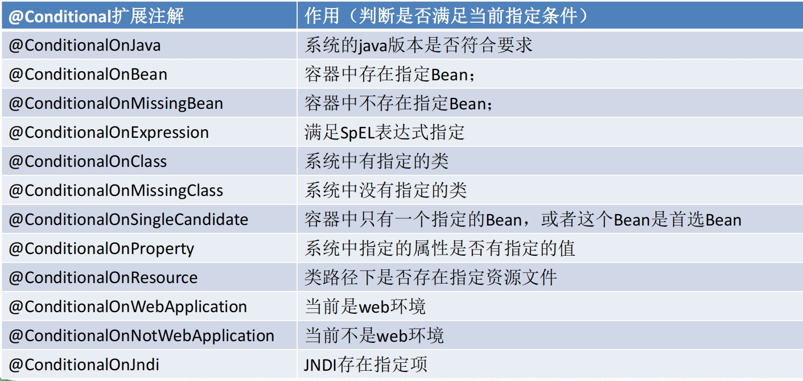

# Spring Boot 配置

Spring Boot 通常情况下会启动自动配置，但他可以通过读取固定路径下的固定名称的配置文件，修改Spring Boot 自动装配的默认值。主要包含如下几点：

- 固定路径为：src/main/resources目录或者类路径/config下

- 固定名称的配置文件有两种：
    
    - application.properties
    - application.yml

- 配置文件的作用：修改SpringBoot自动配置的默认值

## 1 yml 配置简介

yml是YAML（YAML Ain't Markup Language）语言的文件，以数据为中心，比json、xml等更适合做配置文件

    - yml配置
        ```yml
        server:
            port: 8081
        ```
    - xml配置
        ```xml
        <server>
            <port>8081</port>
        </server>
        ```
    - properties配置
        ```properties
        server.port=8080
        ```
扩展思考：为啥有 properties 配置 Spring Boot 还要yml配置？

- 语法简洁性，YAML使用缩进和层次结构来表示配置之间的关系，语法更加简洁明了；
    ```yml
    spring:
        datasource:
            url: jdbc:mysql://localhost:3306/mydb
            username: root
            password: password
            driver-class-name: com.mysql.cj.jdbc.Driver
    ```
    ```properties
    spring.datasource.url=jdbc:mysql://localhost:3306/mydb
    spring.datasource.username=root
    spring.datasource.password=password
    spring.datasource.driver-class-name=com.mysql.cj.jdbc.Driver
    ```
- 数据结构支持，YAML原生支持列表、映射等复杂数据结构，能够更自然地表达配置信息；
- 可读性和可维护性，YAML的缩进和层次结构使得配置文件的结构清晰，易于阅读和维护；
- 多环境配置支持，YAML文件可以通过---分隔符在同一个文件中定义多个环境的配置；
    ```yml
    spring:
        profiles: dev
    datasource:
        url: jdbc:mysql://localhost:3306/devdb
        username: devuser
        password: devpassword

    ---
    spring:
        profiles: prod
    datasource:
        url: jdbc:mysql://prodserver:3306/proddb
        username: produser
        password: prodpassword
    ```

## 2 YAML语法

### 2.1 基本语法

- k:(空格)v：表示一对键值对（空格必须有）；
- 使用空格缩进表示层级关系；
- 缩进的空格数目不重要，只要相同层级的元素左侧对齐即可；
- 属性和值大小写敏感。

### 2.2 YAML值的常用写法

YAML 支持的三种数据结构：字面量、对象、数组，详细说明如下。


- **字面量**

    - 单个的、不可再分的值；可以是数字、字符串、布尔、日期。
    - 字符串默认不使用引号（单引号或双引号），使用引号代表特殊含义：

        - 双引号（""）:表不会转义字符串里面的特殊字符；特殊字符会作为本身想表示的意思，例如
            ```yml
            name: "zhangsan \n lisi"
            输出 ==> zhangsan 换行 lisi
            ```
        - 单引号（''）:表会转义特殊字符，特殊字符最终只是一个普通的字符串数据
            ```yml
            name: "zhangsan \n lisi"
            输出 ==> zhangsan \n lisi
            ```
- **对象**

    - 键值对的集合，可以是对象（属性: 属性值）、Map（key: value）；
    - 对象还是 k:(空格)v 的方式；
    - 换行缩进写法：
        ```yml
        custom:
            name: zhangsan
            age: 20
        ```
    - 行内写法：
        ```yml
        custom: {name: zhangsan,age: 18}
        ```

- **数组**

    - 一组按次序排列的值，可以是数组、list、set
    - 数组中可以嵌套对象
    - 换行缩进写法，用- 值表示数组中的一个元素
         ```yml
        pets:
        ‐ cat
        ‐ dog
        ‐ pig
        ```
    - 行内写法：
        ```yml
        pets: [cat,dog,pig]
        ``` 
- **文档快**
    
    - 多个文档用---隔开


注意：
- Spring Boot使用 snakeyaml 解析yml文件；
- 语法参考：https://bitbucket.org/asomov/snakeyaml/wiki/Documentation#markdown-header-yaml-syntax 


## 3 配置文件值注入

### 3.1 @ConfigurationProperties为属性注值

- yml 配置
    ```yml
        person:
            lastName: hello
            age: 18
            boss: false
            birth: 2017/12/12
            maps: {k1: v1,k2: 12}
            lists:
                ‐ lisi
                ‐ zhaoliu
            dog:
                name: 小狗
                age: 12
    ```
- bean
    ```java
        /**
         * 将配置文件中配置的每一个属性的值，映射到这个组件中
        * 1、将这个组件在容器中 @Component，才能够进行映射
        * 2、@ConfigurationProperties：告诉SpringBoot将本类中的所有属性和配置文件中相关的配置进行绑定；
        *   prefix = "person"：配置文件中哪个下面的所有属性进行一一映射
        *
        */
        @ConfigurationProperties(prefix = "person")
        @Component
        public class Person {
            private String lastName;
            private int age;
            private boolean boss;
            private Date birth;
            private Map<String, Object> maps;
            private List<Object> lists;
            private Dog dog;
    ```

- pom依赖
    ```xml
        <!‐‐导入配置文件处理器，配置文件进行绑定就会有提示‐‐>
        <dependency>
        <groupId>org.springframework.boot</groupId>
        <artifactId>spring‐boot‐configuration‐processor</artifactId>
        <optional>true</optional>
        </dependency>
    ```

### 3.2 @Value获取值和@ConfigurationProperties获取值比较


从上图对比总结如下：
- 若只在某个业务逻辑中需要获取配置文件中的某项值，使用@Value；
- 若有专门编写了javaBean来和配置文件进行映射，则使用@ConfigurationProperties

### 3.3 配置文件注入值数据校验
    
    ```java
        @Component
        @ConfigurationProperties(prefix = "person")
        @Validated
        public class Person {
            /**
            * <bean class="Person">
            * <property name="lastName" value="字面量/${key}从环境变量、配置文件中获取值/#
            {SpEL}"></property>
            * <bean/>
            */
            //lastName必须是邮箱格式
            @Email
            //@Value("${person.last‐name}")
            private String lastName;
            // ...
        }
    ```
### 3.4 @PropertySource&@ImportResource&@Bean

- @PropertySource : 加载指定的配置文件
    ```java
        @PropertySource(value = {"classpath:person.properties"})
        @Component
        @ConfigurationProperties(prefix = "person")
    ```

- @ImportResource ：导入Spring的配置文件，使配置文件内容生效，但Spring Boot 不推荐使用这种繁琐的方式；
- Spring Boot 推荐使用全注解的方式给容器中添加组件

    - 配置类@Configuration--> 相当于Spring配置文件
    - 使用@Bean给容器中添加组件
        ```java
            /**
             * @Configuration：声明配置类相当于Spring的配置文件
            *
            * 在配置文件中用<bean><bean/>标签添加组件
            *
            */
            @Configuration
            public class MyAppConfig {

                //将方法的返回值添加到容器中；容器中这个组件默认的id就是方法名
                @Bean
                public HelloService helloService(){
                    System.out.println("MyAppConfig 通过 @Bean 给容器中添加ID为helloService的组件");
                    return new HelloService();
                }

            }
        ```
## 4 配置文件占位符

- 随机数
    ```yml
        ${random.value}、${random.int}、${random.long}
        ${random.int(10)}、${random.int[1024,65536]}
    ```
- 属性配置占位符
    ```yml
        person.last‐name=张三${random.uuid}
        person.age=${random.int}
        person.birth=2017/12/15
        person.boss=false
        person.maps.k1=v1
        person.maps.k2=14
        person.lists=a,b,c
        person.dog.name=${person.hello:hello}_dog
        person.dog.age=15
    ```
    - 可以在配置文件中引用前面配置过的属性（优先级高于前面配置过的这里都能用）
    - ${app.name:默认值}来指定找不到属性时的默认值

## 5 Profile
Profile是Spring对不同环境提供不同配置功能的支持，可以通过激活、指定参数等方式快速切换环境。

- 多 profile 文件形式，格式形如：格式：application-{profile}.properties/yml

    - application-dev.properties
    - application-prod.properties

- yml类型，多profile文档块模式
    ```yml
        server:
            port: 8081
        spring:
            profiles:
                active: prod   # spring.profiles.active:激活指定配置
        ‐‐‐
        server:
            port: 8083
        spring:
            profiles: dev
        ‐‐‐  # 3条横线表分割多个profile区域（文档块）
        server:
            port: 8084
        spring:
            profiles: default #表未指定默认配置
    ```

- profile 激活方式：

    - 配置文件：spring.profiles.active=dev
    - 命令行：--spring.profiles.active=dev
    - jvm参数：–Dspring.profiles.active=dev

## 6 配置文件加载位置
spring boot 启动会扫描以下位置的 application.properties 或 application.yml 文件作为 Spring boot 的默认配置文件。

- file:./config/
- file:./ ## 工程根目录
- classpath:/config/
- classpath:/

以上是按照**优先级从高到低**的顺序，所有位置的文件都会被加载，高优先级配置内容会覆盖低优先级配置内容（内容互相补充）。也可以通过命令参数的形式，在项目启动时设值 spring.config.location 来改变默认配置（优先级更高）
```cmd
    java -jar lab21-springboot-0.0.1-SNAPSHOT.jar --spring.config.location=D:/application.properties
```
## 7 外部配置加载顺序

Spring Boot 可以从以下位置加载配置，优先级从高到低；高优先级的配置覆盖低优先级的配置，所有的配置会形成互补配置。

- 1.命令行参数，所有的配置都可以在命令行上进行指定，形如：--配置项=值；多个配置用空格分开
    ```cmd
        java -jar lab21-springboot-0.0.1-SNAPSHOT.jar --server.port=8088 --server.context-path=/helloCMD

    ```
- 2.来自java:comp/env的JNDI属性
- 3.Java系统属性（System.getProperties()）
- 4.操作系统环境变量
- 5.RandomValuePropertySource配置的random.*属性值

| 注：1、优先加载带profile，由jar包外向jar包内进行寻找

- 6.jar包外部的application-{profile}.properties或application.yml(带spring.profile)配置文件
- 7.jar包内部的application-{profile}.properties或application.yml(带spring.profile)配置文件

| 注：2、再来加载不带profile
- 8.jar包外部的application.properties或application.yml(不带spring.profile)配置文件
- 9.jar包内部的application.properties或application.yml(不带spring.profile)配置文件
- 10.@Configuration注解类上的@PropertySource
- 11.通过SpringApplication.setDefaultProperties指定的默认属性

具体参考：[官方文档](https://docs.spring.io/spring-boot/docs/current-SNAPSHOT/reference/htmlsingle/#boot-features-external-config)

## 8 自动配置原理
配置文件应该怎么写呢？可以参考: [官网配置文件属性配置说明](https://docs.spring.io/spring-boot/docs/1.5.9.RELEASE/reference/htmlsingle/#common-application-properties)

从源码的角度，剖析自动配置原理：

- 1、SpringBoot 启动的时候加载主配置类，通过 @EnableAutoConfiguration 开启自动配置功能；
    ```java
        @AutoConfigurationPackage
        @Import(AutoConfigurationImportSelector.class)
        public @interface EnableAutoConfiguration {
            // 将主配置类（@SpringBootApplication标注的类）所在的包及子包下所有的组件扫描到Spring容器中
            String ENABLED_OVERRIDE_PROPERTY = "spring.boot.enableautoconfiguration";
        }
  ```
- 2、@EnableAutoConfiguration 作用：

    - @EnableAutoConfiguration注解中，导入了AutoConfigurationImportSelector（自动配置导入选择器），选择器如何选择组件的呢？
        ```java

        public class AutoConfigurationImportSelector implements ...{
            // ...
            // 选择需要导入的组件
            public String[] selectImports(AnnotationMetadata annotationMetadata) {
                // ...
                AutoConfigurationEntry autoConfigurationEntry = 
                        this.getAutoConfigurationEntry(annotationMetadata);
                // ...    
            }

            protected AutoConfigurationEntry getAutoConfigurationEntry(AnnotationMetadata annotationMetadata) {
                    // ...
                List<String> configurations = 
                        this.getCandidateConfigurations(annotationMetadata, attributes);
                    // ...
            }

            protected List<String> getCandidateConfigurations(AnnotationMetadata metadata, AnnotationAttributes attributes) {
                // 两个参数值：EnableAutoConfiguration.class ,xxxClassLoader
                List<String> configurations = 
                        SpringFactoriesLoader.loadFactoryNames(
                            this.getSpringFactoriesLoaderFactoryClass(), this.getBeanClassLoader());
                // ...
            }
            
            private static Map<String, List<String>> loadSpringFactories(@Nullable ClassLoader classLoader) {
                // ...
                Enumeration<URL> urls = classLoader.getResources("META-INF/spring.factories");
                // ...
        ```
    - 从如上源码可发现：从 selectImports() 方法进入，里面调用了 SpringFactoriesLoader.loadFactoryNames，加载所有jar包类路径下 META‐INF/spring.factories 文件，并将文件中读取到的配置数据封装成 properties 对象，然后从 properties对象中取 EnableAutoConfiguration.class（key）对应的值，再把他们加载到Spring容器中。
    - 每一个形如：xxxAutoConfiguration 类都是容器中的组件，将加入到容器中用来做自动配置；
        

- 3、这些 xxxAutoConfiguration 配置类是如何进行自动配置功能的呢？以HttpEncodingAutoConfiguration（Http编码自动配置）为例进行详细说明

    ```java
    // @Configuration声明配置类（相当于配置文件），里面封装了@Component，意味着这个组件会加载到Spring容器中
    @Configuration(
        proxyBeanMethods = false
    )

    // 启动指定类的 ConfigurationProperties 功能；将配置文件中对应的值和 ServerProperties 绑定起来；并把  ServerProperties 加入到 Spring 容器中
    @EnableConfigurationProperties({ServerProperties.class})

    // 里面封装了 Spring 的 @Conditional注解，表示如果满足指定的条件，整个配置类里面的配置就会生效；具体意思为：判断当前应用是否是web应用，如果是，当前配置类生效
    @ConditionalOnWebApplication(
        type = Type.SERVLET
    )

    // 判断当前工程中有没有 CharacterEncodingFilter（SpringMVC中进行乱码解决的过滤器）；
    @ConditionalOnClass({CharacterEncodingFilter.class})

    // 判断配置文件中是否存在并开启 spring.http.encoding 配置，不配置默认也是存在并且生效的；
    @ConditionalOnProperty(
        prefix = "server.servlet.encoding",
        value = {"enabled"},
        matchIfMissing = true
    )
    public class HttpEncodingAutoConfiguration {
        
        // properties 属性已经和 Spring Boot 中的配置文件做了映射（ServerProperties）
        private final Encoding properties;

        //只有一个有参构造器的情况下，参数的值就会从容器中拿
        public HttpEncodingAutoConfiguration(ServerProperties properties) {
            this.properties = properties.getServlet().getEncoding();
        }

        //@Bean 将 CharacterEncodingFilter 组件添加到容器中，这个组件的初始值从从properties中获取
        @Bean
        @ConditionalOnMissingBean
        public CharacterEncodingFilter characterEncodingFilter() {
            CharacterEncodingFilter filter = new OrderedCharacterEncodingFilter();
            filter.setEncoding(this.properties.getCharset().name());
            filter.setForceRequestEncoding(this.properties.shouldForce(org.springframework.boot.web.servlet.server.Encoding.Type.REQUEST));
            filter.setForceResponseEncoding(this.properties.shouldForce(org.springframework.boot.web.servlet.server.Encoding.Type.RESPONSE));
            return filter;
        }


    }
    ```
    从如上源码可看出：首先根据 xxxConfiguration 配置类注册的条件判断这个配置类是否生效，如果生效则配置类会向容器添加相关的组件，组件的初始值是从对应的 xxxProperties 类中获取，而这些xxxProperties 类又是和 Spring Boot 的配置文件绑定的。

- 4、所有在配置文件中能配置的属性是在 xxxxProperties 类中封装的，配置文件能配置什么属性可以参照某个功能组件对应的这个属性类
    ```java
        @ConfigurationProperties(
            prefix = "server",
            ignoreUnknownFields = true
        )
        public class ServerProperties {
            private Integer port;
            private InetAddress address;
            // ...
        }
    ```

总结：
- SpringBoot启动会加载大量的自动配置类；
- 先看需要的功能中有没有SpringBoot默认写好的自动配置类；
- 再看这个自动配置类中配置了哪些组件（如果有我们需要的功能组件，那么就不需要再配置，如果没有可以自定义功能组件）
- 给容器中自动配置类添加组件的时，会从xxxProperties类中获取某些属性,所以我们可以在配置文件中指定这些属性的值；
- 两个重要的类：
    - xxxAutoConfigurartion：自动配置类，给容器中添加组件
    - xxxProperties:封装配置文件中相关属性


### @Conditional扩展

@ConditionalXxx 注解中封装了@Conditional，当 @ConditionalXxx 指定的条件成立了，才给容器中添加组件，配置文件中的相关的配置才生效。



可以通过启用 ```debug=true``` 属性，来让控制台打印自动配置报告，方便我们查看哪些自动配置
类生效了。
```log
    =========================
    AUTO‐CONFIGURATION REPORT
    =========================

    Positive matches:（匹配成功的自动配置类）
    ‐‐‐‐‐‐‐‐‐‐‐‐‐‐‐‐‐
    DispatcherServletAutoConfiguration matched:
    ‐ @ConditionalOnClass found required class 'org.springframework.web.servlet.DispatcherServlet';   @ConditionalOnMissingClass did not find unwanted class (OnClassCondition)
    ‐ @ConditionalOnWebApplication (required) found StandardServletEnvironment (OnWebApplicationCondition)
    
    ....

    Negative matches:（没有匹配到的自动配置类）
    ‐‐‐‐‐‐‐‐‐‐‐‐‐‐‐‐‐
    ActiveMQAutoConfiguration:
    Did not match:
    ‐ @ConditionalOnClass did not find required classes 'javax.jms.ConnectionFactory',
    'org.apache.activemq.ActiveMQConnectionFactory' (OnClassCondition)
    ...
   
```

## 参考资料
- [SpringBoot 视频教程全集（112P）| 23 小时从入门到精通](https://www.bilibili.com/video/av59572480/)


